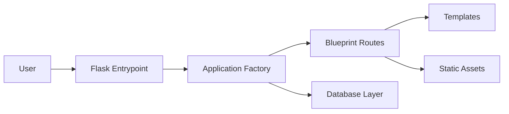

# Spendly Expense Tracker


A production-structured Flask expense tracking project with a clean landing page, authentication screens, and a scalable package layout for future development.

## Overview

This repository contains **Spendly**, an expense tracker project organized like a real-world Flask application rather than a classroom-style single-file app.

The current version includes:

- A structured Flask application factory setup
- Blueprint-based routing
- Reusable templates and static assets
- Landing, login, and registration pages
- A database module scaffold for future SQLite integration
- Clear separation between entrypoint, configuration, routes, templates, and static files

## Project Snapshot



## Repository Structure

```text
.
├── README.md
├── requirements.txt
└── expense-tracker/
    ├── app.py
    ├── config.py
    ├── requirements.txt
    └── expense_tracker/
        ├── __init__.py
        ├── routes.py
        ├── database/
        │   ├── __init__.py
        │   └── db.py
        ├── static/
        │   ├── css/
        │   └── js/
        └── templates/
            ├── base.html
            ├── landing.html
            ├── login.html
            └── register.html
```

## Features

- Marketing-style landing page for the product
- Sign in and registration interfaces
- Clean Flask package structure
- Centralized configuration
- Ready for SQLite integration and route expansion
- Easy to extend with services, models, forms, and tests

## Tech Stack

- Python
- Flask
- Jinja2 templates
- HTML/CSS/JavaScript
- SQLite-ready database layer
- Pytest and pytest-flask for testing

## Getting Started

### 1. Clone the repository

```bash
git clone https://github.com/bffl24/website-using-codex.git
cd website-using-codex
```

### 2. Create and activate a virtual environment

```bash
python3 -m venv .venv
source .venv/bin/activate
```

### 3. Install dependencies

```bash
pip install -r expense-tracker/requirements.txt
```

### 4. Run the application

```bash
cd expense-tracker
python app.py
```

The app runs locally at:

```text
http://127.0.0.1:5001
```

## Available Routes

| Route | Purpose |
| --- | --- |
| `/` | Landing page |
| `/register` | Registration page |
| `/login` | Login page |
| `/logout` | Placeholder logout route |
| `/profile` | Placeholder profile route |
| `/expenses/add` | Placeholder add expense route |
| `/expenses/<expense_id>/edit` | Placeholder edit expense route |
| `/expenses/<expense_id>/delete` | Placeholder delete expense route |

## Development Notes

This project is intentionally structured for growth. The UI layer is in place, while parts of the business logic and persistence layer are still scaffolded.

The next production-oriented improvements would be:

- Implement the SQLite database helpers in `expense_tracker/database/db.py`
- Add user authentication and session handling
- Build expense CRUD flows
- Add tests for routes and data access
- Introduce environment-based configuration
- Add deployment configuration for Gunicorn or a containerized setup

## Design Direction

The current interface is designed to feel modern and product-oriented instead of boilerplate. It uses:

- Strong branding with a dedicated visual identity
- Responsive layout patterns
- Reusable base templates
- A clean split between content, styling, and behavior

## Author

Built and organized by Udayan Panda with Codex support.
